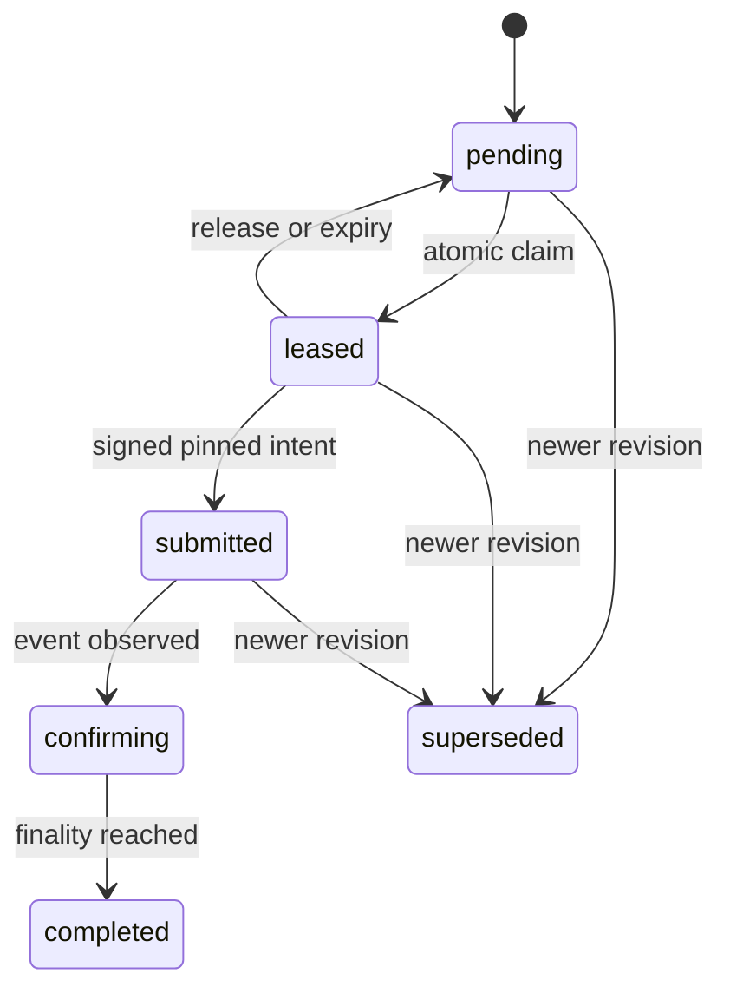

# ADR 002: CHW verification, finality, and incentive protocol

> **Code map:** For a file-by-file mapping of every concept in this ADR to the
> TypeScript export that implements it, see
> [docs/chw-protocol-code-map.md](chw-protocol-code-map.md).

- Status: accepted for the Lafiya web boundary
- Issue: #172
- Date: 2026-08-21

## Decision

CHW identity, review ownership, signed intent, ledger evidence, trust, payout
eligibility, and settlement are separate state machines. A provider response,
UI state, direct contract read, or payment observation must not imply another
state.

The existing `attest(record_hash, attester, timestamp)` interface is a legacy
observation interface: it cannot prove a lease or idempotency key. It may be
observed during migration but cannot create new protocol trust or payout state.
`contracts/chw-attestation-protocol-v1.json` is the required implementation
fixture for `lafiya-contracts` and `lafiya-verifier`.

## Privacy boundary

Only an HMAC-backed commitment crosses the verifier/ledger boundary. No patient
identity, health data, user ID, card ID, revision ID, secret, or authorization
artifact is permitted in events, memos, logs, traces, checkpoints, quarantine,
URLs, or alerts. The database holds a commitment only to bind an authorized
immutable revision to ledger evidence; it is never publicly returned or logged.
The CHW lease response contains only the exact disclosure-policy projection.

## State transitions

### Identity

| State                                 | May claim/sign                                          | Historical evidence |
| ------------------------------------- | ------------------------------------------------------- | ------------------- |
| `pending`                             | No                                                      | none                |
| `active`                              | Yes, with valid credential and allowlist-synced address | retained            |
| `suspended`, `rotating`, `recovering` | No                                                      | retained            |
| `offboarded`                          | No                                                      | retained            |

Supabase identity authorizes queue access; the contract allowlist independently
authorizes the Stellar address. Binding changes require address ownership proof
and dual-control approval. Rotation creates a new binding; recovery never
reveals a secret or rewrites a completed intent/obligation recipient.

### Request, intent, and trust



Claims lock the request, verify it is the current revision, and persist the CHW
and address-binding snapshot with a lease token. A canonical, signed,
short-lived intent binds request, revision commitment/schema, CHW/address,
network-passphrase hash, contract/version, event version, expiry, and
idempotency key. The database rejects expiry, stale revision, wrong owner, and
replay independently of the signature.

| Trust state          | Required evidence                                    |
| -------------------- | ---------------------------------------------------- |
| `unverified`         | no valid intent/evidence                             |
| `submitted`          | submitted intent only                                |
| `confirming`         | matching event, insufficient finality                |
| `verified`           | current revision plus matching finalized event/epoch |
| `expired`, `revoked` | explicit contract evidence                           |
| `superseded`         | no longer current revision                           |
| `conflicted`         | provider disagreement or reorganization              |
| `unavailable`        | bounded provider failure                             |

Provider success can only produce `confirming`, never `verified`.

## Accounting and reorganization

Finalizing matching evidence atomically writes the trust decision and one
immutable obligation. The recipient is copied from the intent's address binding;
later row changes cannot redirect it. Settlement independently checks recipient,
amount, asset, and sponsor. Any mismatch or payment-before-obligation is
quarantined. The invariant is:

```
obligations = settled + pending + quarantined + explicitly adjusted
```

The `payout_obligation_reconciliation` view reports this per day.

The indexer is at-least-once and applies an event before advancing a checkpoint.
Duplicate event and intent identities converge. Malformed or unsupported events
are quarantined with opaque metadata. On a ledger-hash mismatch, invalidate
evidence, change trust to `conflicted`, quarantine the pending obligation,
rewind to the last matching checkpoint, replay, and run reconciliation. This is
repeatable and never creates a second obligation.

## Epochs, operations, and rollout

`protocol_epochs` is the only registry for supported schema/network/contract/
event/finality/payout combinations. An upgrade adds an epoch and retains the
old epoch for historical interpretation; it never reinterprets old evidence.
Credential approval, address changes, allowlist synchronization, contract
admin, treasury, pause, and key rotation require dual control. Break-glass can
suspend new work but cannot sign as a CHW or redirect an obligation.

1. Apply the migration and seed a disposable testnet epoch.
2. Enroll test CHWs with address proof and allowlist synchronization.
3. Implement and validate the shared intent/event fixture in contracts/verifier.
4. Rehearse replay, fork, and reconciliation recovery.
5. Activate live protocol only after compatibility tests pass.

Production rejects mock attestations and incomplete protocol configuration.

## Consequences

The multiple independent state machines (identity, request, intent, trust, obligation) mean no single provider response can advance more than one machine at a time. This prevents silent shortcuts (e.g., a successful provider call implying finality) but adds implementation surface. The at-least-once indexer requires idempotent event processing and a tested replay/rewind path. Break-glass and dual-control requirements mean no single operator can reroute a payout or sign as a CHW, at the cost of slower key-rotation and credential-change operations. Legacy `attest()` calls cannot create new protocol trust or payout state and must be deprecated once all verifiers move to the new intent/event protocol.
