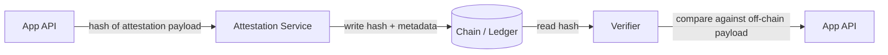
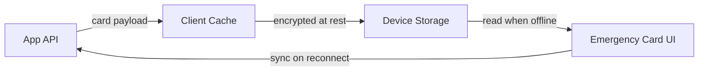
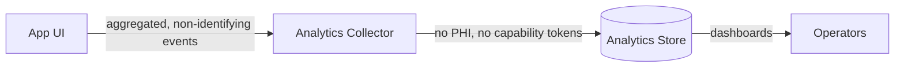

# Data Protection Impact Assessment (DPIA): Emergency Card System

- **Status:** Draft for review
- **Owner:** Privacy Engineering
- **Related issue:** #574
- **Scope:** Public emergency card, CHW verification, on-chain attestations, offline caching, analytics
- **Out of scope:** Legal certification

This DPIA documents the processing activities of the emergency card system, the associated
risks, likelihood/severity scoring, and mitigations mapped to concrete code controls, ADRs,
or tracked issues. It is maintained alongside the RoPA (`docs/compliance/ropa.md`) and the
data-residency configuration (`compliance/residency.json`).

## 1. Processing activities and data flows

### 1.1 Public emergency card

```mermaid
flowchart LR
  A[Patient / Cardholder] -->|creates card, sets visibility| B[Emergency Card UI]
  B -->|card payload (no PHI in URL)| C[App API]
  C -->|persist card record| D[(Primary datastore)]
  C -->|public read by card id| E[Public Card Viewer]
  E -->|renders non-sensitive fields| F[First responder / bystander]
```

### 1.2 CHW verification

```mermaid
flowchart LR
  A[Community Health Worker] -->|authenticates| B[Auth Provider]
  B -->|session + role claim| C[App API]
  C -->|verifies CHW role| D[Verification Service]
  D -->|grants scoped access| E[Protected Card Fields]
  C -->|audit event (no PHI)| F[(Audit Log)]
```

### 1.3 On-chain attestations



### 1.4 Offline caching



### 1.5 Analytics



## 2. Risk register

Scoring: Likelihood (L) and Severity (S) on a 1–5 scale; Risk = L x S.
High risk is defined as Risk >= 12.

| ID | Risk | L | S | Risk | Mitigation / Tracking |
|----|------|---|---|------|-----------------------|
| R1 | Re-identification from on-chain hashes (low-entropy payloads, correlation) | 3 | 5 | 15 | Salted, domain-separated hashing in the attestation service; only hashes written on-chain. See `docs/adr/` attestation ADR and issue #574 follow-up for salt rotation. |
| R2 | Capability leakage (tokens in logs, URLs, third parties) | 3 | 5 | 15 | Never log, persist, or send PHI or capability tokens to third parties (repo policy). Tokens kept out of URLs; redaction in logging. Tracked in `SECURITY.md` and issue #574 follow-up. |
| R3 | Offline device theft (cached card data at rest) | 3 | 4 | 12 | Client cache encrypted at rest; cache scoped to device and cleared on logout. See offline caching section and issue #574 follow-up for cache TTL. |
| R4 | CHW coercion (pressure to disclose protected fields) | 2 | 5 | 10 | Scoped access, audit events without PHI, and role verification. See CHW verification flow and `SECURITY.md`. |
| R5 | Analytics re-identification via aggregation | 2 | 4 | 8 | Only aggregated, non-identifying events; no PHI or capability tokens. See analytics flow. |
| R6 | Cross-region data transfer | 2 | 4 | 8 | Runtime region enforcement via `compliance/residency.json` and `scripts/generate-ropa.mjs`. |

Every high risk (R1, R2, R3) has a mitigation and/or a tracked issue.

## 3. Mitigation mapping

| Mitigation | Code / ADR / Issue |
|------------|--------------------|
| Salted, domain-separated hashing for attestations | `docs/adr/` attestation ADR; issue #574 follow-up |
| No PHI or capability tokens to third parties | `SECURITY.md`; repo policy |
| Encrypted offline cache, cleared on logout | Offline caching flow; issue #574 follow-up |
| Scoped CHW access with audit events | CHW verification flow; `SECURITY.md` |
| Aggregated analytics only | Analytics flow |
| Runtime region enforcement | `compliance/residency.json`; `scripts/generate-ropa.mjs` |

## 4. Review process

- [ ] Security sign-off
- [ ] Clinical sign-off
- [ ] Legal sign-off

## 5. References

- `docs/compliance/ropa.md`
- `compliance/residency.json`
- `scripts/check-doc-links.mjs`
- `SECURITY.md`
